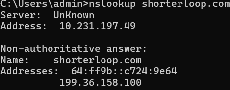
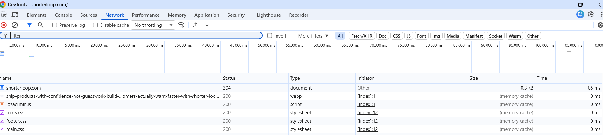

 # web-request--flow
This project demonstrates what happens behind the scenes when a user opens a website, from DNS lookup to receiving the webpage in the browser. It covers DNS, TCP, TLS, HTTP requests, and browser rendering.

Introduction

When we type a website URL  into the browser and press Enter, the webpage does not appear instantly. Behind the scenes, several networking steps occur within milliseconds before the browser displays the page.

1. DNS (Domain Name System)
What it does: DNS converts the website name into an IP address.
Example:

shorterloop.com
        ↓
76.76.21.21
The browser cannot communicate using the website name, so it first asks a DNS server for the corresponding IP address.
Command used:
Bash
nslookup shorterloop.com
If available:
Bash
dig shorterloop.com +short

2. TCP (Transmission Control Protocol)
Once the IP address is known, the browser establishes a TCP connection with the server.
This happens using the Three-Way Handshake:
Client → SYN
Server → SYN-ACK
Client → ACK
This ensures a reliable connection before any data is exchanged.

4. TLS (Transport Layer Security)
Since the website uses HTTPS, a TLS handshake occurs.
During this step:
The server sends its SSL/TLS certificate.
The browser verifies the certificate.
Both create encryption keys.
Now all communication is encrypted and secure.

6. HTTP Request
The browser sends an HTTP request to the server.
Example:

GET /
The server processes the request and prepares the webpage.

5. HTTP Response
The server sends back:
HTML
CSS
JavaScript
Images
Fonts
Status Code (e.g., 200 OK)
The browser may send many additional requests to download all these files.

Conclusion

When a user enters a website URL and presses Enter, the browser performs several networking steps before displaying the webpage. It first uses DNS to find the website's IP address, establishes a reliable connection using TCP, secures the connection with TLS, sends an HTTP request, and receives the server's response. Finally, the browser processes the HTML, CSS, and JavaScript files and paints the pixels to render the webpage on the screen. This assignment demonstrated that what appears to be an instant action actually involves multiple coordinated processes happening within milliseconds.

